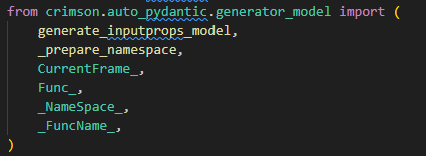
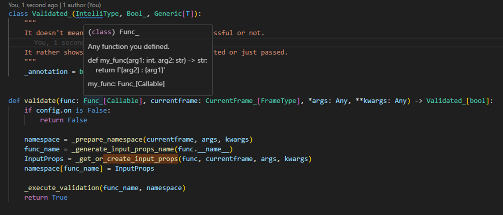
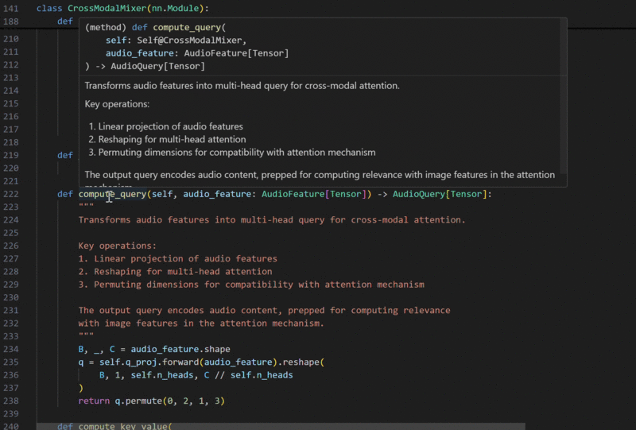

# IntelliType

IntelliType is a Python library that provides enhanced type annotations with custom structure and validation capabilities. It combines the power of static type hinting with runtime type checking and validation, while ensuring full intellisense support.

## Features

- Enhanced type annotations with full intellisense support
- Runtime type checking and validation
- Integration with Pydantic for robust data validation
- Support for custom metadata in type definitions

## Installation

You can install IntelliType using pip:

```
pip install crimson-intelli-type
```


## Quick Start

Here's a simple example of how to use IntelliType:

```python
from typing import List, Generic, TypeVar
from crimson.intelli_type import IntelliType

T = TypeVar('T')

class IntList(IntelliType[List[int]], Generic[T]):
    """A list that only contains integers."""

# This will pass and provide full intellisense support
valid_list: IntList[List[int]] = IntList.type_safe([1, 2, 3])

# This will raise a validation error
invalid_list: IntList[List[int]] = IntList.type_safe(["a", "b", "c"])
```

### Adding Custom Metadata

IntelliType supports adding custom metadata to your type definitions:

```python
class CustomType(IntelliType[List[int]], Generic[T]):
    """A list of integers with custom metadata."""

# Usage with metadata
my_var: CustomType[List[int], "This is custom metadata"] = [1, 2, 3]

# Accessing metadata
print(CustomType.get_meta())  # Output: ('This is custom metadata',)
```

A further usage of metadata is planned. Coming soon...


## Why use Generic[T]?

Including `Generic[T]` in your IntelliType class definition is crucial for proper intellisense support. It allows your IDE to provide accurate type hints and autocompletion, enhancing your development experience and catching potential type errors early.

## Examples

### AutoPydantic


I used IntelliType to add type hints to [AutoPydantic](https://github.com/crimson206/auto-pydantic). The custom types are imported from another script. In the current script, you can easily access the type information by hovering over the variables.

**^0.1.x version syntax**






### DeepLearning

Please check out the example in the link below. When using IntelliType, we don't write docstrings for attributes in the function documentation. Instead, arguments are individually documented, and their docstrings are reused throughout the code. This allows you to focus the function's documentation solely on describing its purpose and behavior.

[DeepLearning Example](https://github.com/crimson206/intelli-type/tree/main/example)



## Reusability

One of the biggest advantages of IntelliType is its reusability. Many arguments are often used across different functions. Traditionally, you would need to write the docstring for these arguments repeatedly.

The worst-case scenario is when you've written docstrings in multiple places and can't remember where they all are. When you modify one of your arguments, you'd need to edit all the related docstrings. However, with IntelliType, the information for your arguments is used consistently, allowing you to manage your package more cleanly and reliably.
