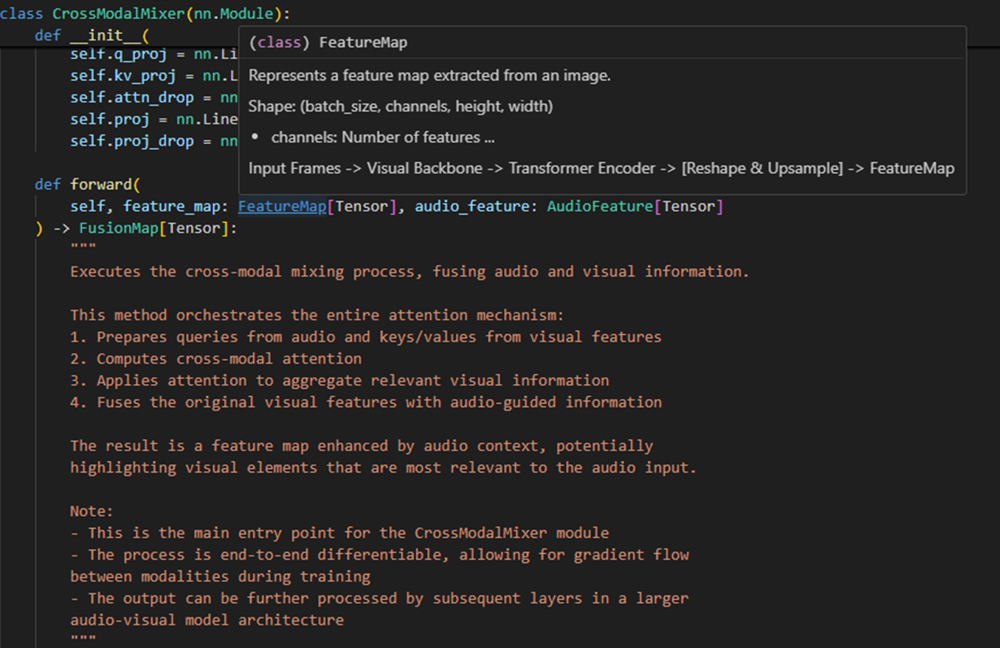

# IntelliType

IntelliType is a Python library that provides enhanced type annotations with custom structure and validation capabilities. It combines the power of static type hinting with runtime type checking and validation, while ensuring full intellisense support.

## Features

- Enhanced type annotations with full intellisense support
- Runtime type checking and validation
- Integration with Pydantic for robust data validation
- Support for custom metadata in type definitions

## Installation

You can install IntelliType using pip:

```
pip install crimson-intelli-type
```

## Quick Start

Here's a simple example of how to use IntelliType:

```python
from typing import List, Generic, TypeVar
from crimson.intelli_type import IntelliType

T = TypeVar('T')

class IntList(IntelliType, List[int], Generic[T]):
    pass

# This will pass and provide full intellisense support
valid_list: IntList[List[int]] = IntList.type_safe([1, 2, 3])

# This will raise a validation error
invalid_list: IntList[List[int]] = IntList.type_safe(["a", "b", "c"])
```

## Advanced Usage

IntelliType supports adding custom metadata to your type definitions:

```python
class CustomType(IntelliType, List[int], Generic[T]):
    pass

CustomType[List[int], "This is custom metadata"]
```

## Why use Generic[T]?

Including `Generic[T]` in your IntelliType class definition is crucial for proper intellisense support. It allows your IDE to provide accurate type hints and autocompletion, enhancing your development experience and catching potential type errors early.

## Examples

[AutoPydantic](https://github.com/crimson206/auto-pydantic)


    
[DeepLearning Documentation](https://github.com/crimson206/intelli-type/tree/main/example)



