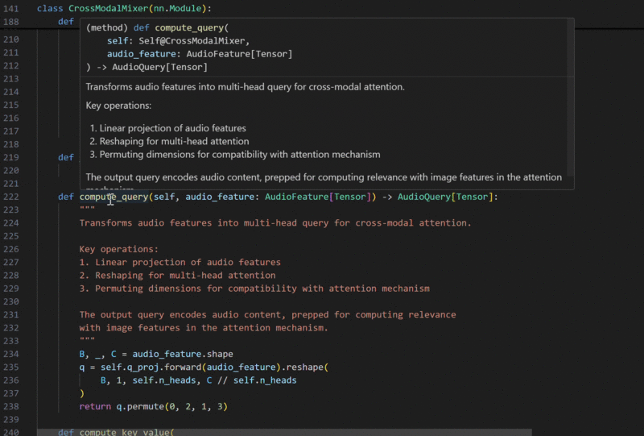
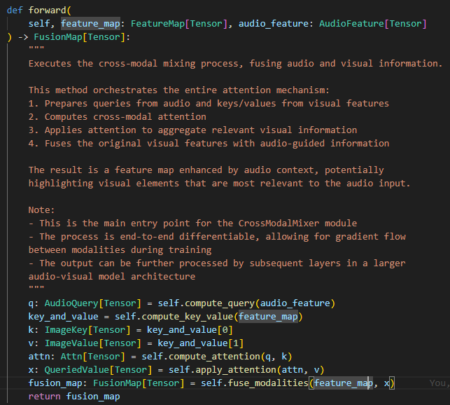

Title: "IntelliType: Enhancing Python Type Hinting for All"
Subtitle: "Improving Code Documentation from General Python Projects to Complex AI Model Architectures"

## IntelliType

I recently published a Python type-hint library called [intelli-type](https://github.com/crimson206/intelli-type). The main purpose is to enhance type-hinting with Intellisense.

## Intellisense

When using IntelliType, you need to define custom type hints.

```python
class AudioFeature(IntelliType[Tensor], Generic[T]):
    """
    VggishOutput representation.

    Shape: (batch_size, 1, channels)
    - channels: Number of audio features

    Input Audio Waves -> AudioFeature
    """
```

The type `AudioFeature` is equivalent to Tensor.

Even though you define the type when you create `AudioFeature`,
you still need to specify the type when you use it for type hinting.

```python
def forward(
    self, feature_map: FeatureMap[Tensor], audio_feature: AudioFeature[Tensor]
) -> FusionMap[Tensor]:
    pass
```

Adding `Generic[T]` enhances Intellisense.

```python
# Intellisense with Generic[T]

(method) def forward(
    self: Self@CrossModalMixer,
    feature_map: FeatureMap[Tensor],
    audio_feature: AudioFeature[Tensor]
) -> FusionMap[Tensor]
```

```python
# Intellisense without Generic[T]

(method) def forward(
    self: Self@CrossModalMixer,
    feature_map: FeatureMap,
    audio_feature: AudioFeature
) -> FusionMap
```


**Gif. Runtime Example**

## Strict Annotation

If you have already defined `AudioFeature` as `Tensor`, you can't use this type with other types. The syntax below will cause an error.

```python
def func(
    audio_feature: AudioFeature[str]
):
    ...
```

## Single Responsibility & Reusability

Traditionally, we write the description of arguments in the docstring of a function.
The same argument can be used in different functions, so we need to repeat the same task. The critical problem is that the descriptions for the same argument are not programmatically connected. If we want to update the description of the argument, we must do it manually.


**Fig. Function Dedicated Docstring**

Using IntelliType, the description for `feature_map` is written in FeatureMap and can be reused everywhere. You update the docstring in FeatureMap, and the change is applied everywhere programmatically. Therefore, we can write dedicated docstrings for functions and arguments separately.

## Namespace

I am pioneering and establishing [Micro-wise development](https://github.com/crimson206/microwise-development). To avoid 'namespace pollution', I am publishing all the modules with the namespace 'crimson'. Therefore,

```python
# import syntax is

from crimson.intelli_type import IntelliType
```

```bash
# install the package with the command line

pip install crimson-intelli-type
```

### Post History
Written: 16/07/2024