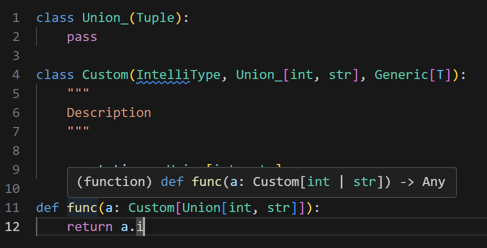
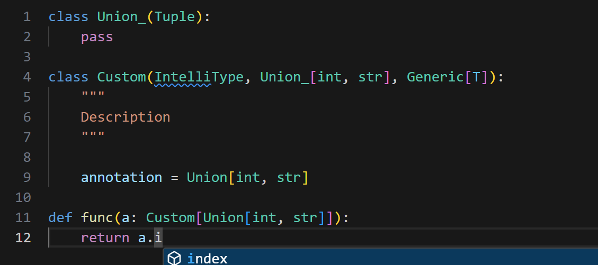
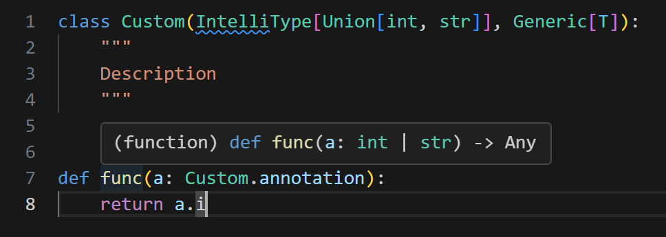
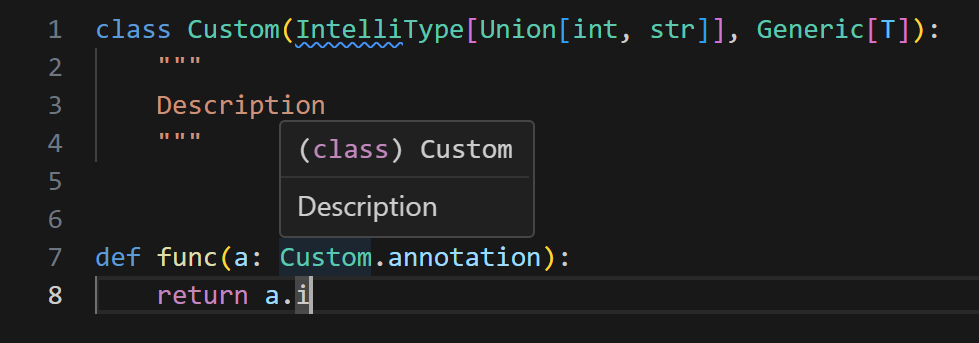
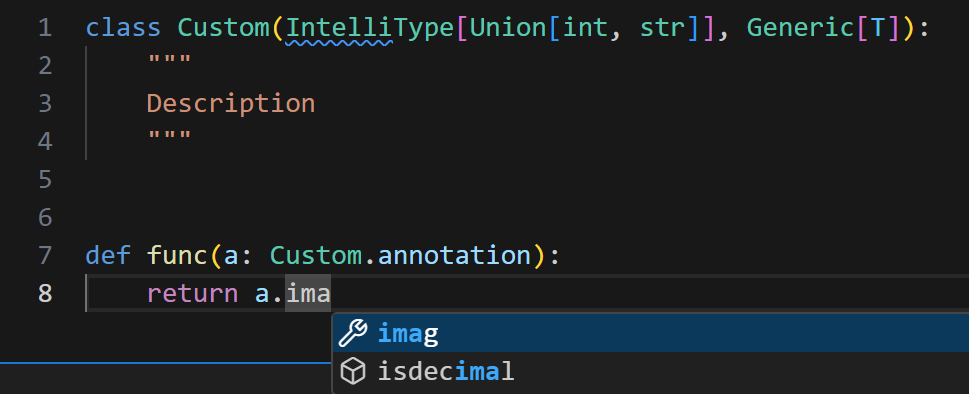

# Escape

As I developed this intelli-type module, I agreed on two syntaxes. They are implemented in versions 0.1.x and 0.3.x. Although I liked the 0.3.x version when I developed it, I discovered a critical problem with it today (19.07.2024). Each version has its pros and cons, so I will preserve both syntaxes in version 0.4.

In this post, we will learn how to use them alternatively.

## General

The version 0.3.x syntax has a critical problem. The return annotation of the `__class_getitem__` function is not analyzed by (at least VSCode) IDE. While our annotation works programmatically, we can't get IDE support such as Auto-Completion.

Therefore, it is better to revert to the 0.1.x version syntax, which inherits the type classes directly.

```python
class CustomType(IntelliType, int, Generic[T]):
    """
    docstring
    """
```

This syntax works perfectly during runtime and with IDE support, but only when it doesn't cause an error. We can't use this syntax with types such as `Union`, `Literal`, `bool`, and possibly more unchecked types.

I decided to set the 0.1.x syntax as the main one, and we will use the 0.3.x syntax to escape errors caused by problematic types.

## Escape

### Version 0.1.x

Using the version 0.1.x syntax, we can preserve full hover intellisense.



However, autocompletion is no longer functional.



### Version 0.3.x

While the 0.1.x syntax requires the annotation in the function as well, the 0.3.x one doesn't. The annotation field is type-hinted directly from the Base of IntelliType.

If we use the version 0.3.x syntax, we lose the name of our custom type in the hover over the function.

This disadvantage is not so critical. Even if we can read the name of our type from a function, we still need to go to the definition of the function if we want to read the docstring of our type.

In the function definition, we can read the entire docstring by hovering without jumping everywhere.




Just check if the Auto-Completion works fine.



Good! We can still enjoy a comfortable development environment.

## Summary

If the annotation can't be a subclass, use the version 0.3.x syntax to escape the type error:

```python
class Version03Type(IntelliType[int], Generic[T]):
    "docstring"

def func(arg: Version03Type.annotation):
    pass
```

type error.
Otherwise, use the version 0.1 syntax.


```python
class Version01Type(IntelliType, int, Generic[T]):
    "docstring"

def func(arg: Version01Type[int]):
    pass
```

By using these guidelines, you can leverage the strengths of both syntaxes depending on the scenario.