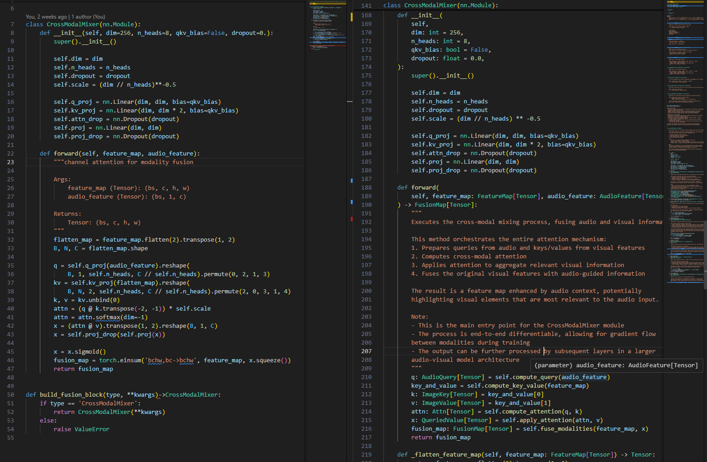
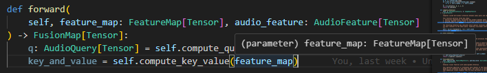

title: IntelliType: Enhancing Python Type Hinting for All
subtitle: Improving Code Documentation from General Python Projects to Complex AI Model Architectures

## IntelliType

IntelliType is a Python module designed to enhance type hinting by providing hoverable docstrings that improve code readability and maintenance [[1](#ref-1)], [[2](#ref-2)]. For installation instructions, please refer to the GitHub Repository or the Devto Post linked in the references.

## Fully Documented With IntelliType

I added documentation to the CrossModalMixer [[3](#ref-3)] model as an example of IntelliType. The number of lines increased from ~50 to ~300. In this post, I will explain why writing these additional lines is beneficial.


**Fig. Without and with Full Documentation [[4](#ref-4)]**

### Argument

From the name of `feature_map`, we can assume that it is a feature map extracted from an image. Since it is an AVS model, it might be from frames. However, the exact source isn't clear. We want to clarify it, but the name of an argument can't be too long. Therefore, we need to add a dedicated docstring to the argument as shown below.

```python
class FeatureMap(IntelliType[Tensor], Generic[T]):
    """
    Represents a feature map extracted from an image.

    Shape: (batch_size, channels, height, width)
        - channels: Number of features
        ...

    Input Frames ->
    Visual Backbone ->
    Transformer Encoder ->
    [Reshape & Upsample] ->
    FeatureMap
    """
```

Once you type hint the argument, it refers to the custom type, and you can easily read its description. Find the block `(parameter) feature_map: FeatureMap[Tensor]` in the figure.


**Fig. Typehinted Argument**

This approach is useful during model development and extraordinarily helpful for readers when you publish your model.

### Function

- **Dedicated Docstring for Function**:\
    Since we wrote the docstring for each argument, you can focus on describing the function itself in the function's docstring.

- **Tracking Meaning of Process**:\
    After the functions, the meaning of variables often becomes abstract. See the code block below. We are performing a cross-attention mechanism using two different input sources. In this case, the source of key and value is not clear. To prevent this, we type hint the return values, maintaining the meaning 'programmatically'.

```python
    def compute_key_value(
        self, feature_map: FeatureMap
    ) -> Tuple[ImageKey[Tensor], ImageValue[Tensor]]:
        """
        Transforms the image feature map into key and value tensors for multi-head attention.
        ...
        """
        flatten_map = self._flatten_feature_map(feature_map)
        B, N, C = flatten_map.shape
        kv = self.kv_proj.forward(flatten_map).reshape(
            B, N, 2, self.n_heads, C // self.n_heads
        )
        kv = kv.permute(2, 0, 3, 1, 4)
        return kv.unbind(0)
```

### Across Module

The defined custom types can be imported into other modules (scripts). Don't consider the documentation as a waste of time. If you use IntelliType, you can enjoy very strong reusability.

## More Pythonic than Pydantic

### Pythonic Syntax

The strongest alternative to IntelliType is `pydantic`. It also provides very nice solutions for type hinting. The shortcoming is that you define a holder of arguments, but not the arguments themselves directly, using pydantic.

Therefore, if you want to use a pydantic model as input props, you can't use the very flexible syntax of the function definition.

```python
class InputProps(BaseModel):
    arg1: str = Field(..., description='Description here')
    arg2: int = ...

def func(input_props: InputProps):
    ...
```

It is 'pydantic', but not 'pythonic'.
If we use `IntelliType`, we can stick to the general syntax and add the additional type hints without modifying the original syntax.

### Exposed Docstring

If you hover your mouse on `InputProps`, you can read the docstring for the `InputProps` class, but not the description for arguments written in `Field`. The hoverable docstring was the main motivation for IntelliType, and it doesn't lose its advantage compared to `pydantic` or `Annotated` from typing as well.

### Is IntelliType better than Pydantic?

Of course not. I would say they have different purposes. Although I developed IntelliType, the frequency I use pydantic won't decrease.

## Reference

- [1]: [GitHub Repository](https://github.com/crimson206/intelli-type) <span id="ref-1"></span>
- [2]: [Devto Post](https://dev.to/crimson206/intellitype-python-type-hinting-with-hoverable-docstrings-2bck) <span id="ref-2"></span>
- [3]: [CrossModalMixer](https://github.com/vvvb-github/AVSegFormer/blob/master/model/utils/fusion_block.py) <span id="ref-3"></span>
- [4]: [Example Scripts](https://github.com/crimson206/intelli-type/tree/main/example) <span id="ref-4"></span>